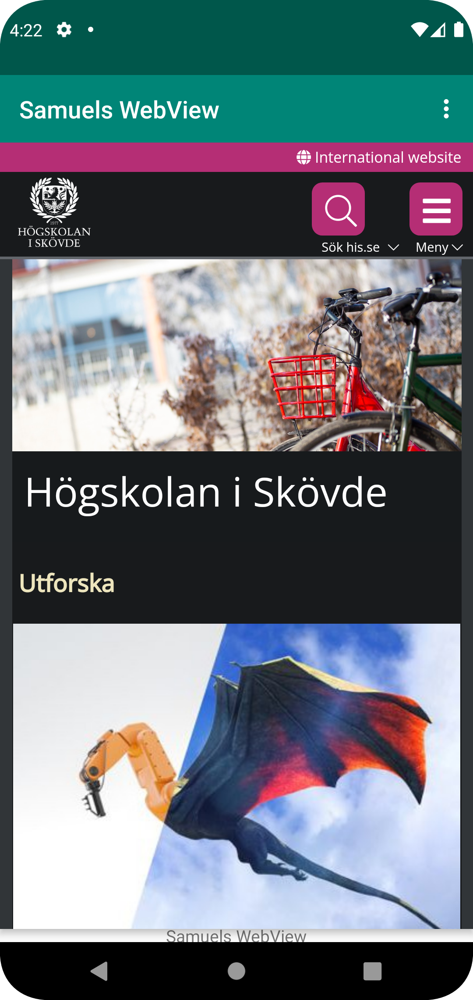
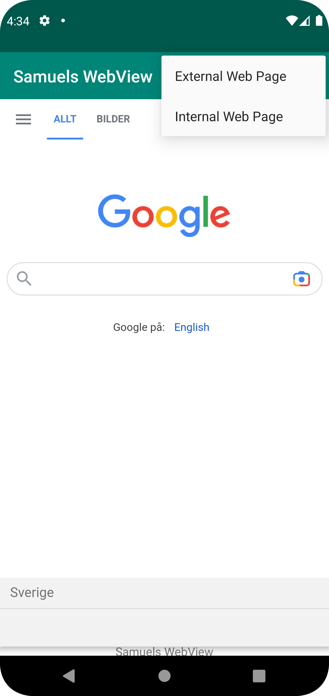

# Rapport
Började med att skapa mitt eget projekt genom att forka och clona ner det förbyggda appen till Android Studio.
Sedan ändrade jag namnet på appen till Samuels WebView som syns på bilden efter: 

Efter detta enablade jag Internet på appen samt skapade min WebView. Jag gav den ett ID och gjorde 
sedan en variabel som jag kallade myWebView. Jag localiserade det och skapade sedan en WebViewClient 
som jag sedan satte ihop med min WebView. Efter detta enablade jag javascript på min WebViewClient.
Det som skrivits om ovan syns nedan:

    myWebView = findViewById(R.id.my_webview);
    myWebView.setWebViewClient(new WebViewClient());
    myWebView.loadUrl("https://his.se");
    WebSettings webSettings = myWebView.getSettings();
    webSettings.setJavaScriptEnabled(true);
 
Sist så skulle man fixa två olika sidor, en extern och en intern. Jag gjorde en HTML sida för den interna 
samt en länk till google som den externa.  Nedan syns hur detta såg ut:

    public void showExternalWebPage(){
    // TODO: Add your code for showing external web page here
    myWebView.loadUrl("https://google.se");
    }

    public void showInternalWebPage(){
    // TODO: Add your code for showing internal web page here
    myWebView.loadUrl("file:///android_asset/about.html");
    }

